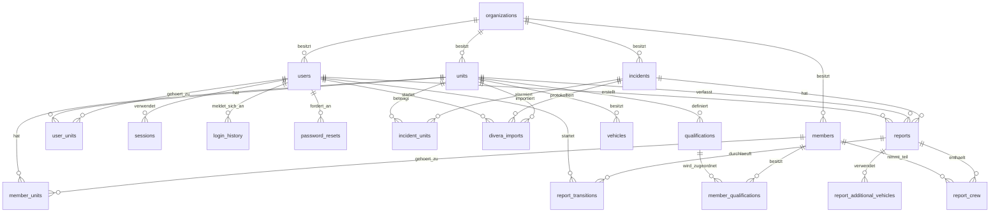

# Datenmodell

Das produktive Datenmodell liegt in MySQL 8. Maßgebliche Quelle für das Schema
ist `schema.sql`; `api.php` enthält die fachlichen Abfragen, während `support.php` die gemeinsamen Datenbank- und Validierungsfunktionen bereitstellt. Diese Datei beschreibt Tabellen, Beziehungen und
fachliche Regeln.

`GET /api/bootstrap` prüft vor Einrichtung und Anmeldung die Datenbankverbindung sowie das Vorhandensein aller in diesem Dokument beschriebenen Tabellen. Eine fehlende Konfiguration, nicht erreichbare Datenbank oder unvollständige Migration wird mit HTTP 503 gemeldet; dabei werden keine Zugangsdaten ausgegeben.
Die Anwendung initialisiert jede PDO-Verbindung explizit mit `utf8mb4`.
API-Routen bleiben unabhängig davon `/api/...`, ob die Anwendung im Dokumentenstamm oder in einem Unterverzeichnis installiert ist; der Installationspfad wird vor dem Routing entfernt.
`GET /api/system` liest ausschließlich für die Wehrleitung nicht geheime Konfigurationsmetadaten einschließlich der validierten Build-ID sowie die vorhandenen Einheiten und Benutzer. Die Übersicht speichert keine zusätzlichen Daten.

`schema.sql` wird nicht durch den SFTP-Workflow deployt. Schemaänderungen
werden vor dem Anwendungscode kontrolliert über die Datenbankverwaltung des
Hosters eingespielt.

Für lokale Entwicklung initialisiert der MySQL-Container `schema.sql` beim
Anlegen eines neuen Docker-Volumes. Bei bestehenden Volumes führt der
Compose-Dienst `migrate` alle noch nicht in `schema_migrations` vermerkten
Dateien aus `migrations/` vor dem Start der Webanwendung aus. Die lokale
Webanwendung ist ausschließlich an die Loopback-Adresse gebunden und erhält
keine lokale Produktivkonfiguration.

## Überblick



Eine `organization` ist ein Mandant. Tabellen ohne eigene
`organization_id` werden über ihre übergeordnete Einheit, ihren Einsatz oder
ihren Bericht einem Mandanten zugeordnet. Die Anwendung prüft diese Grenze bei
jeder fachlichen Abfrage.

Sitzungen werden ausschließlich über HTTPS im `Secure`-, `HttpOnly`- und `SameSite=Strict`-Cookie `__Host-session` übertragen.

## Tabellen

### `organizations`

| Spalte | Typ | Bedeutung |
|---|---|---|
| `id` | BIGINT UNSIGNED, PK | Interne ID der Wehr |
| `name` | VARCHAR(200), NOT NULL | Name der Wehr |

### `units`

| Spalte | Typ | Bedeutung |
|---|---|---|
| `id` | BIGINT UNSIGNED, PK | Interne ID der Einheit |
| `organization_id` | BIGINT UNSIGNED, FK | Zugehörige Wehr |
| `name` | VARCHAR(200), NOT NULL | Innerhalb der Wehr eindeutiger Name |
| `divera_access_key` | VARCHAR(500), NULL | Server-seitiger DIVERA-Schlüssel |

Eindeutig ist `(organization_id, name)`; durch die Datenbankkollation unterscheiden sich Namen dabei nicht allein durch Groß- und Kleinschreibung.

### `users`

Anmeldebenutzer sind von den in Einsätzen verwendeten Mitgliedern getrennt.

| Spalte | Typ | Bedeutung |
|---|---|---|
| `id` | BIGINT UNSIGNED, PK | Interne Benutzer-ID |
| `organization_id` | BIGINT UNSIGNED, FK | Zugehörige Wehr |
| `unit_id` | BIGINT UNSIGNED, FK, NULL | Kompatible Primärzuordnung; maßgeblich ist `user_units` |
| `name` | VARCHAR(200), NOT NULL | Anzeigename |
| `email` | VARCHAR(320), NOT NULL, UNIQUE | Syntaktisch validierte E-Mail-Adresse; Groß-/Kleinschreibung wird ignoriert |
| `password_hash` | VARCHAR(255), NOT NULL | Durch `password_hash` erzeugter Hash; bis zur Annahme einer Einladung ist ein unbekannter Zufallswert gespeichert |
| `role` | ENUM, NOT NULL | `wehrleitung`, `einheitsleitung` oder `fuehrungskraft` |

Die Wehrleitung hat keine Einheitszuordnung, eine Einheitsführung gehört exakt einer Einheit an und eine Führungskraft mindestens einer, optional mehreren Einheiten.

### `user_units`

Viele-zu-viele-Zuordnung von Benutzern zu Einheiten.

| Spalte | Typ | Bedeutung |
|---|---|---|
| `user_id` | BIGINT UNSIGNED, FK, PK | Benutzer |
| `unit_id` | BIGINT UNSIGNED, FK, PK | Einheit |

Beide Fremdschlüssel werden beim Löschen ihres Elternsatzes kaskadiert.

### `sessions`

| Spalte | Typ | Bedeutung |
|---|---|---|
| `token` | CHAR(64), PK | SHA-256-Hash des zufälligen 256-Bit-Sitzungswerts |
| `user_id` | BIGINT UNSIGNED, FK | Angemeldeter Benutzer |
| `expires_at` | DATETIME, NOT NULL | Ablaufzeitpunkt; Sitzungen gelten zwölf Stunden |

Der Klartext-Sitzungswert existiert nur im Browsercookie. Sitzungen werden beim Löschen des Benutzers mitgelöscht.

### `login_history`

Speichert ausschließlich erfolgreiche Anmeldungen. IP-Adresse, Browserdaten und fehlgeschlagene Versuche werden nicht erfasst.

| Spalte | Typ | Bedeutung |
|---|---|---|
| `id` | BIGINT UNSIGNED, PK | Interne ID |
| `user_id` | BIGINT UNSIGNED, FK | Angemeldeter Benutzer |
| `logged_in_at` | DATETIME, NOT NULL | Anmeldezeitpunkt in UTC |

Die Verwaltung zeigt der Wehrleitung den neuesten Eintrag pro Benutzer. Beim Löschen eines Benutzers wird seine Login-Historie mitgelöscht.

### `password_resets`

Die Tabelle wird sowohl für Passwort-Wiederherstellungen als auch für Einladungen neuer Benutzer verwendet. In beiden Fällen setzt der Benutzer über denselben einmaligen Token selbst ein Passwort.
Die zugehörigen Links werden standardmäßig über PHP `mail()` oder bei vorhandener SMTP-Konfiguration authentifiziert und TLS-geschützt versendet; SMTP-Zugangsdaten werden nicht in der Datenbank gespeichert.

| Spalte | Typ | Bedeutung |
|---|---|---|
| `id` | BIGINT UNSIGNED, PK | Interne ID |
| `user_id` | BIGINT UNSIGNED, FK, UNIQUE | Benutzer mit höchstens einem aktiven Token |
| `token_hash` | CHAR(64), UNIQUE | SHA-256-Hash des zufälligen 256-Bit-Tokens |
| `requested_at` | DATETIME, NOT NULL | Zeitpunkt der Anforderung und Grundlage der Fünf-Minuten-Sperre |
| `expires_at` | DATETIME, NOT NULL | Ablaufzeitpunkt: Einladungen nach sieben Tagen, Passwort-Wiederherstellungen nach 30 Minuten |

Der Klartexttoken wird nur per E-Mail versendet und nie gespeichert. Nach erfolgreichem Zurücksetzen werden der Token und alle Sitzungen des Benutzers gelöscht. Die Wehrleitung kann für fremde Benutzer eine neue Einladung erzeugen; nach erfolgreicher Mailannahme ersetzt sie vorhandene Token, setzt den Passwort-Hash auf einen unbekannten Zufallswert und widerruft alle Sitzungen. Beim Löschen des Benutzers wird auch sein Token mitgelöscht.

Workflow-Benachrichtigungen werden nach dem erfolgreichen Speichern eines
Einsatzes, Berichts oder einer Freigabe unmittelbar versendet. Sie benötigen
keine eigene Tabelle: Versandstatus und Wiederholungsversuche werden in der
ersten Umsetzung bewusst nicht persistiert.

### `incidents`

| Spalte | Typ | Bedeutung |
|---|---|---|
| `id` | BIGINT UNSIGNED, PK | Interne Einsatz-ID |
| `organization_id` | BIGINT UNSIGNED, FK | Zugehörige Wehr |
| `divera_id` | VARCHAR(200), NULL | DIVERA-ID; bei manuellen Einsätzen leer |
| `foreign_id` | VARCHAR(200), NOT NULL | Externe Einsatznummer |
| `divera_date` | BIGINT, NULL | Unveränderter DIVERA-Zeitwert |
| `title` | VARCHAR(300), NOT NULL | Einsatzstichwort |
| `started_at` | VARCHAR(100), NOT NULL | Alarmierungszeit als ISO-Zeitpunkt |
| `message` | TEXT, NOT NULL | Meldung beziehungsweise DIVERA-`text` |
| `address` | VARCHAR(500), NOT NULL | Einsatzadresse |
| `lat`, `lng` | DOUBLE, NULL | Koordinaten |
| `remark` | TEXT, NOT NULL | Bemerkung |
| `patient` | TEXT, NOT NULL | Sensible Patientenangabe |
| `caller` | TEXT, NOT NULL | Sensible Angabe zur meldenden Person |
| `consolidated_text` | TEXT, NOT NULL | Gesamtbericht der Wehrleitung |
| `consolidated_at` | DATETIME, NULL | Zeitpunkt der Konsolidierung |

Ein importierter Einsatz ist über `(organization_id, divera_id)` eindeutig.
Ein erneuter Import aktualisiert ihn. Manuelle Einsätze haben keine
`divera_id`; ihr Zeitpunkt wird als vollständiger UTC-ISO-Zeitwert validiert
und normalisiert. Beim Import sendet der Browser nur diese ID; alle kanonischen
Einsatzfelder werden unmittelbar danach serverseitig erneut aus DIVERA
gelesen.

### `incident_units`

Verknüpft einen Einsatz mit den alarmierten Einheiten.

| Spalte | Typ | Bedeutung |
|---|---|---|
| `incident_id` | BIGINT UNSIGNED, FK, PK | Einsatz |
| `unit_id` | BIGINT UNSIGNED, FK, PK | Beteiligte Einheit |
| `vehicles` | JSON, NOT NULL | Liste der beim Import erkannten Fahrzeuge |

Ein Einsatz kann jeder Einheit nur einmal zugeordnet sein. Beim Löschen des
Einsatzes wird die Zuordnung mitgelöscht.

`vehicles` enthält für neue Importe Objekte dieser Form:

```json
[
  {
    "id": "42",
    "name": "FL HIL 01-LF20-01",
    "shortname": "LF 20",
    "fullname": "Löschgruppenfahrzeug 20",
    "own": true
  }
]
```

`own` bestimmt, ob das Fahrzeug in diesem Einheitsbericht als
Besatzungsziel verwendet werden darf. Ältere Datensätze können aus
Kompatibilitätsgründen reine Fahrzeugnamen enthalten.

Der Import-Snapshot wird nicht um manuell eingesetzte Fahrzeuge ergänzt.
Diese liegen getrennt in `report_additional_vehicles`.

### Abgeleitete Einheitsstatistiken

`GET /api/statistics` speichert keine zusätzlichen Daten. Die erste
Ausbaustufe steht ausschließlich der Einheitsführung zur Verfügung und
aggregiert nur Einsätze ihrer aktuell zugeordneten Einheit im gewählten
lokalen Datumsbereich.

Alarmierte Fahrzeuge stammen aus `incident_units.vehicles`; zusätzliche
tatsächlich eingesetzte Fahrzeuge aus `report_additional_vehicles`.
Mitgliedsbeteiligungen werden über `report_crew` je Bericht gezählt. Der
Besatzungsdurchschnitt teilt alle Besatzungszuordnungen durch die Anzahl
vorhandener Einheitsberichte; Einsätze ohne Bericht erhöhen diesen Nenner
nicht. Vorhandene Berichte zählen unabhängig von ihrem aktuellen
Workflowstatus. Inaktive Mitglieder bleiben über ihren Datensatz in `members`
historisch auswertbar.

Jahr, Monat, Wochentag, Tag/Nacht und Werktag/Wochenende werden aus
`incidents.started_at` in `Europe/Berlin` berechnet. Die Grenzwerte liegen in
`STATISTICS_PERIODS` in `constants.php`.

### `divera_imports`

Protokolliert jeden erfolgreichen DIVERA-Import einschließlich erneuter
Importe eines bereits bekannten Einsatzes.

| Spalte | Typ | Bedeutung |
|---|---|---|
| `id` | BIGINT UNSIGNED, PK | Interne ID |
| `unit_id` | BIGINT UNSIGNED, FK | Importierende Einheit |
| `incident_id` | BIGINT UNSIGNED, FK | Lokal angelegter oder aktualisierter Einsatz |
| `imported_by` | BIGINT UNSIGNED, FK, NULL | Auslösender Benutzer |
| `imported_at` | DATETIME, NOT NULL | Importzeitpunkt in UTC |

Beim Löschen eines Benutzers bleibt der Eintrag mit leerem `imported_by`
erhalten. Die Einsatzübersicht zeigt je Einheit den neuesten Importzeitpunkt.

### `members`

| Spalte | Typ | Bedeutung |
|---|---|---|
| `id` | BIGINT UNSIGNED, PK | Interne Mitglieds-ID |
| `organization_id` | BIGINT UNSIGNED, FK | Zugehörige Wehr |
| `divera_id` | VARCHAR(200), NOT NULL | DIVERA-Mitglieds-ID |
| `name` | VARCHAR(200), NOT NULL | Anzeigename |

Ein Mitglied ist über `(organization_id, divera_id)` innerhalb einer Wehr
eindeutig und kann mehreren Einheiten angehören.

### `member_units`

Viele-zu-viele-Zuordnung von Mitgliedern zu Einheiten.

| Spalte | Typ | Bedeutung |
|---|---|---|
| `member_id` | BIGINT UNSIGNED, FK, PK | Mitglied |
| `unit_id` | BIGINT UNSIGNED, FK, PK | Einheit |
| `active` | BOOLEAN, NOT NULL | Mitglied wird aktuell von DIVERA für die Einheit geliefert |

Ein vollständiger DIVERA-Abgleich setzt zunächst alle Zuordnungen der Einheit
inaktiv und aktiviert anschließend die gelieferten Mitglieder. Inaktive
Zuordnungen bleiben für historische Berichtsbesatzungen erhalten, werden aber
nicht für neue Besatzungszuordnungen angeboten.

### `qualifications`

| Spalte | Typ | Bedeutung |
|---|---|---|
| `id` | BIGINT UNSIGNED, PK | Interne Qualifikations-ID |
| `unit_id` | BIGINT UNSIGNED, FK | Einheit, aus deren DIVERA-Konfiguration sie stammt |
| `divera_id` | VARCHAR(200), NOT NULL | DIVERA-Qualifikations-ID |
| `name` | VARCHAR(200), NOT NULL | Bezeichnung |
| `shortname` | VARCHAR(100), NOT NULL | Kurzbezeichnung |

Eindeutig ist `(unit_id, divera_id)`.

### `member_qualifications`

Viele-zu-viele-Zuordnung von Mitgliedern zu Qualifikationen.

| Spalte | Typ | Bedeutung |
|---|---|---|
| `member_id` | BIGINT UNSIGNED, FK, PK | Mitglied |
| `qualification_id` | BIGINT UNSIGNED, FK, PK | Qualifikation |

### `vehicles`

Die Tabelle enthält den aktuellen, einheitsspezifischen Fahrzeugstamm aus DIVERA. Sie ist von den historischen Fahrzeug-Snapshots in `incident_units.vehicles` getrennt.

| Spalte | Typ | Bedeutung |
|---|---|---|
| `id` | BIGINT UNSIGNED, PK | Interne Fahrzeug-ID |
| `unit_id` | BIGINT UNSIGNED, FK | Zugehörige Einheit |
| `divera_id` | VARCHAR(200), NOT NULL | DIVERA-Fahrzeug-ID |
| `name` | VARCHAR(200), NOT NULL | Anzeigename |
| `shortname` | VARCHAR(100), NOT NULL | Kurzbezeichnung |
| `fullname` | VARCHAR(200), NOT NULL | Vollständige Typbezeichnung |

Eindeutig ist `(unit_id, divera_id)`. Ein Stammdatenabgleich ersetzt den aktuellen Bestand der Einheit vollständig. Beim Import eines Einsatzes werden fremde Fahrzeug-IDs aus einem eindeutigen Fahrzeugstamm einer anderen Einheit derselben Organisation ergänzt; fehlende oder innerhalb der Organisation mehrdeutige IDs bleiben als ID sichtbar. Ein erneuter Einsatzimport aktualisiert den Snapshot, bestehende Snapshots ändern sich nicht allein durch einen Stammdatenabgleich.

### `reports`

| Spalte | Typ | Bedeutung |
|---|---|---|
| `id` | BIGINT UNSIGNED, PK | Interne Berichts-ID |
| `incident_id` | BIGINT UNSIGNED, FK | Zugehöriger Einsatz |
| `unit_id` | BIGINT UNSIGNED, FK | Berichtende Einheit |
| `author_id` | BIGINT UNSIGNED, FK | Erstellender Benutzer |
| `report_year` | SMALLINT UNSIGNED, NULL | Kalenderjahr des Einsatzes in `Europe/Berlin`; bei Altbeständen leer |
| `running_number` | VARCHAR(50), NULL | Manuell vergebene laufende Nummer der Einheit; bei Altbeständen leer |
| `damaged_party` | JSON, NULL | Geschädigte Person mit Name, Telefon und Adresse |
| `damaging_party` | JSON, NULL | Schädiger mit Name, Telefon und Adresse |
| `incident_command` | JSON, NULL | Gesamteinsatzleitung in `rank`/`name` und Einsatzleitung der Einheit in `additionalRank`/`additionalName`, jeweils mit Name und standardmäßig einer Dienstgradabkürzung aus `RANKS`; bestehende benutzerdefinierte Werte bleiben zulässig |
| `narrative` | TEXT, NOT NULL | Freitext des Einheitsberichts |
| `vehicles` | TEXT, NOT NULL | Abgeleitete, kommagetrennte Fahrzeugübersicht |
| `personnel` | TEXT, NOT NULL | Abgeleitete, kommagetrennte Personalübersicht |
| `alarmed_at` | VARCHAR(100), NULL | Alarmierungszeit aus `incidents.started_at` |
| `departed_at` | VARCHAR(100), NULL | Ausrückezeit |
| `arrived_at` | VARCHAR(100), NULL | Eintreffzeit |
| `ended_at` | VARCHAR(100), NULL | Einsatzende |
| `incident_type` | VARCHAR(100), NOT NULL | Validierte Einsatzart |
| `classification` | JSON, NOT NULL | Aufgliederung |
| `status` | ENUM, NOT NULL | `author_draft`, `unit_review` oder `wehr_review` |
| `created_at` | DATETIME, NOT NULL | Erstellungszeit |
| `updated_at` | DATETIME, NOT NULL | Letzte Änderung |
| `released_at` | DATETIME, NULL | Freigabezeit |

Eindeutig ist `(incident_id, unit_id)`: Jede Einheit schreibt pro Einsatz
genau einen Bericht. Zusätzlich ist `(unit_id, report_year, running_number)`
eindeutig, damit eine Einheit dieselbe laufende Nummer innerhalb eines
Kalenderjahres nur einmal vergeben kann. `alarmed_at` und `ended_at` sind
erforderlich; `departed_at` und `arrived_at` dürfen bei abgebrochenen Einsätzen
fehlen. Alle vorhandenen Einsatzzeiten müssen chronologisch sein. `alarmed_at`
wird nicht vom Client übernommen. Die Dauer wird bei der Abfrage
als `duration_minutes` aus `alarmed_at` und `ended_at` berechnet und nicht
gespeichert.

`classification` enthält die in `constants.php` definierten Gruppen und
ausschließlich deren dort festgelegte Werte:

```json
{
  "site": ["Verkehrsfläche"],
  "cause": [],
  "technical": ["Menschen in Notlage"]
}
```

Die Spalten `vehicles` und `personnel` sind nur lesbare Zusammenfassungen aus
`report_crew`; die strukturierte Zuordnung ist maßgeblich.

### `report_transitions`

Die Tabelle bildet die unveränderliche Historie jedes Berichts ab. Auch der Initialstatus wird als Eintrag ohne `from_status` gespeichert.

| Spalte | Typ | Bedeutung |
|---|---|---|
| `id` | BIGINT UNSIGNED, PK | Interne Übergangs-ID |
| `report_id` | BIGINT UNSIGNED, FK | Zugehöriger Bericht |
| `from_status` | ENUM, NULL | Vorheriger Status; beim Initialeintrag leer |
| `to_status` | ENUM, NOT NULL | Neuer Status |
| `actor_id` | BIGINT UNSIGNED, FK, NULL | Auslösender Benutzer; bleibt nach einer späteren Löschung leer erhalten |
| `actor_name` | VARCHAR(200), NOT NULL | Anzeigename zum Übergangszeitpunkt |
| `actor_role` | ENUM, NOT NULL | Rolle zum Übergangszeitpunkt |
| `comment` | VARCHAR(2000), NOT NULL | Pflichtkommentar bei einer Rückgabe, sonst leer |
| `created_at` | DATETIME, NOT NULL | Übergangszeitpunkt |

Die erlaubten Richtungen sind `author_draft → unit_review`, `unit_review → author_draft`, `unit_review → wehr_review` und `wehr_review → unit_review`. Frühere Prüfstufen behalten nach einer Rückgabe Leserechte über die Historie. Eine Rückgabe aus `wehr_review` oder die nachträgliche DIVERA-Zuordnung einer weiteren Einheit leert `incidents.consolidated_at`, bewahrt aber `consolidated_text`.

### `report_crew`

| Spalte | Typ | Bedeutung |
|---|---|---|
| `report_id` | BIGINT UNSIGNED, FK, PK | Bericht |
| `member_id` | BIGINT UNSIGNED, FK, PK | Eingesetztes Mitglied |
| `vehicle` | VARCHAR(200), NOT NULL | Fahrzeugname; leer bedeutet „Ohne Fahrzeug“ |
| `role` | ENUM, NOT NULL | `maschinist`, `einheitsfuehrer` oder `besatzung` |

Ein Mitglied kann pro Bericht nur einmal vorkommen. Pro Fahrzeug sind
höchstens ein Maschinist und ein Einheitsführer zulässig; die Besatzung ist
unbegrenzt. Ohne Fahrzeug ist nur die Rolle `besatzung` erlaubt. Diese Regeln
und die Zugehörigkeit des Mitglieds zur Einheit werden von der Anwendung
validiert.

### `report_additional_vehicles`

Speichert Fahrzeuge der eigenen Einheit, die nicht im ursprünglichen
DIVERA-Snapshot enthalten waren, als Namens-Snapshot am Einheitsbericht.

| Spalte | Typ | Bedeutung |
|---|---|---|
| `report_id` | BIGINT UNSIGNED, FK, PK | Einheitsbericht |
| `vehicle` | VARCHAR(200), PK | Fahrzeugname zum Zeitpunkt der Auswahl |

Neu hinzugefügt werden können ausschließlich Fahrzeuge aus dem aktuellen
Stamm der Berichtseinheit. Bereits gespeicherte Fahrzeuge bleiben erhalten,
wenn sie später nicht mehr von DIVERA geliefert werden, sind dann aber nicht
für neue Besatzungszuordnungen verfügbar.

Bearbeitung und Statusübergang eines Berichts werden über eine Zeilensperre koordiniert. Status und Historieneintrag entstehen in derselben Transaktion; doppelte oder veraltete Übergänge werden mit HTTP 409 abgelehnt.

## Lösch- und Konsistenzverhalten

- Alle Tabellen verwenden InnoDB und `utf8mb4`; MySQL-Fremdschlüssel sind
  aktiv.
- Einsätze löschen ihre Einheitszuordnungen, Berichte und
  Besatzungszuordnungen kaskadierend.
- Benutzer löschen ihre Sitzungen, Login-Historie und Einheitszuordnungen kaskadierend.
- Mitglieder und Qualifikationen löschen ihre Zuordnungen kaskadierend.
- Für Organisationen, Einheiten, Autoren und in Berichten verwendete
  Mitglieder gibt es bewusst keine allgemeine Löschfunktion.
- Mandantengleichheit, Rollen, Zeitreihenfolge, gültige Einsatzarten,
  Aufgliederungen und Besatzungsregeln werden zusätzlich im Server geprüft.

## Datenschutz

`password_hash`, Klartext-Sitzungswerte und `units.divera_access_key` dürfen nicht
über die API ausgegeben oder protokolliert werden. `incidents.patient` und
`incidents.caller` sowie `reports.damaged_party` und
`reports.damaging_party` sind sensible Einsatzdaten und müssen stets auf den
aktuellen Mandanten und die bestehenden Berichtsrechte begrenzt bleiben.
