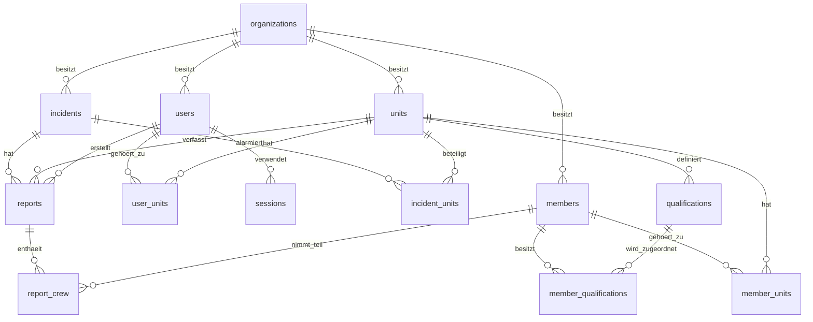

# Datenmodell

Das produktive Datenmodell liegt in SQLite unter `data/app.db`. Maßgebliche
Quelle für das tatsächliche Schema bleibt `server.js`; diese Datei beschreibt
die Tabellen, Beziehungen und fachlichen Regeln.

## Überblick



Eine `organization` ist ein Mandant. Tabellen ohne eigene
`organization_id` werden über ihre übergeordnete Einheit, ihren Einsatz oder
ihren Bericht einem Mandanten zugeordnet. Die Anwendung prüft diese Grenze bei
jeder fachlichen Abfrage.

## Tabellen

### `organizations`

| Spalte | Typ | Bedeutung |
|---|---|---|
| `id` | INTEGER, PK | Interne ID der Wehr |
| `name` | TEXT, NOT NULL | Name der Wehr |

### `units`

| Spalte | Typ | Bedeutung |
|---|---|---|
| `id` | INTEGER, PK | Interne ID der Einheit |
| `organization_id` | INTEGER, FK | Zugehörige Wehr |
| `name` | TEXT, NOT NULL | Innerhalb der Wehr eindeutiger Name |
| `divera_access_key` | TEXT, NULL | Server-seitiger DIVERA-Schlüssel |

Eindeutig ist `(organization_id, name)`.

### `users`

Anmeldebenutzer sind von den in Einsätzen verwendeten Mitgliedern getrennt.

| Spalte | Typ | Bedeutung |
|---|---|---|
| `id` | INTEGER, PK | Interne Benutzer-ID |
| `organization_id` | INTEGER, FK | Zugehörige Wehr |
| `unit_id` | INTEGER, FK, NULL | Kompatible Primärzuordnung; maßgeblich ist `user_units` |
| `name` | TEXT, NOT NULL | Anzeigename |
| `email` | TEXT, NOT NULL, UNIQUE | Groß-/Kleinschreibung wird ignoriert |
| `password_hash` | TEXT, NOT NULL | `scrypt`-Hash mit individuellem Salt |
| `role` | TEXT, NOT NULL | `wehrleitung`, `einheitsleitung` oder `fuehrungskraft` |

Nur die Wehrleitung darf ohne Einheitszuordnung existieren.

### `user_units`

Viele-zu-viele-Zuordnung von Benutzern zu Einheiten.

| Spalte | Typ | Bedeutung |
|---|---|---|
| `user_id` | INTEGER, FK, PK | Benutzer |
| `unit_id` | INTEGER, FK, PK | Einheit |

Beide Fremdschlüssel werden beim Löschen ihres Elternsatzes kaskadiert.

### `sessions`

| Spalte | Typ | Bedeutung |
|---|---|---|
| `token` | TEXT, PK | Zufälliger Sitzungswert |
| `user_id` | INTEGER, FK | Angemeldeter Benutzer |
| `expires_at` | TEXT, NOT NULL | Ablaufzeitpunkt; Sitzungen gelten zwölf Stunden |

Sitzungen werden beim Löschen des Benutzers mitgelöscht.

### `incidents`

| Spalte | Typ | Bedeutung |
|---|---|---|
| `id` | INTEGER, PK | Interne Einsatz-ID |
| `organization_id` | INTEGER, FK | Zugehörige Wehr |
| `divera_id` | TEXT, NULL | DIVERA-ID; bei manuellen Einsätzen leer |
| `foreign_id` | TEXT, NOT NULL | Externe Einsatznummer |
| `divera_date` | INTEGER, NULL | Unveränderter DIVERA-Zeitwert |
| `title` | TEXT, NOT NULL | Einsatzstichwort |
| `started_at` | TEXT, NOT NULL | Alarmierungszeit als ISO-Zeitpunkt |
| `message` | TEXT, NOT NULL | Meldung beziehungsweise DIVERA-`text` |
| `address` | TEXT, NOT NULL | Einsatzadresse |
| `lat`, `lng` | REAL, NULL | Koordinaten |
| `remark` | TEXT, NOT NULL | Bemerkung |
| `patient` | TEXT, NOT NULL | Sensible Patientenangabe |
| `caller` | TEXT, NOT NULL | Sensible Angabe zur meldenden Person |
| `consolidated_text` | TEXT, NOT NULL | Gesamtbericht der Wehrleitung |
| `consolidated_at` | TEXT, NULL | Zeitpunkt der Konsolidierung |

Ein importierter Einsatz ist über `(organization_id, divera_id)` eindeutig.
Ein erneuter Import aktualisiert ihn. Manuelle Einsätze haben keine
`divera_id`.

### `incident_units`

Verknüpft einen Einsatz mit den alarmierten Einheiten.

| Spalte | Typ | Bedeutung |
|---|---|---|
| `incident_id` | INTEGER, FK, PK | Einsatz |
| `unit_id` | INTEGER, FK, PK | Beteiligte Einheit |
| `vehicles` | TEXT, NOT NULL | JSON-Liste der beim Import erkannten Fahrzeuge |

Ein Einsatz kann jeder Einheit nur einmal zugeordnet sein. Beim Löschen des
Einsatzes wird die Zuordnung mitgelöscht.

`vehicles` enthält für neue Importe Objekte dieser Form:

```json
[
  {
    "id": "42",
    "name": "FL HIL 01-LF20-01",
    "shortname": "LF 20",
    "fullname": "Löschgruppenfahrzeug 20",
    "own": true
  }
]
```

`own` bestimmt, ob das Fahrzeug in diesem Einheitsbericht als
Besatzungsziel verwendet werden darf. Ältere Datensätze können aus
Kompatibilitätsgründen reine Fahrzeugnamen enthalten.

### `members`

| Spalte | Typ | Bedeutung |
|---|---|---|
| `id` | INTEGER, PK | Interne Mitglieds-ID |
| `organization_id` | INTEGER, FK | Zugehörige Wehr |
| `divera_id` | TEXT, NOT NULL | DIVERA-Mitglieds-ID |
| `name` | TEXT, NOT NULL | Anzeigename |

Ein Mitglied ist über `(organization_id, divera_id)` innerhalb einer Wehr
eindeutig und kann mehreren Einheiten angehören.

### `member_units`

Viele-zu-viele-Zuordnung von Mitgliedern zu Einheiten.

| Spalte | Typ | Bedeutung |
|---|---|---|
| `member_id` | INTEGER, FK, PK | Mitglied |
| `unit_id` | INTEGER, FK, PK | Einheit |

### `qualifications`

| Spalte | Typ | Bedeutung |
|---|---|---|
| `id` | INTEGER, PK | Interne Qualifikations-ID |
| `unit_id` | INTEGER, FK | Einheit, aus deren DIVERA-Konfiguration sie stammt |
| `divera_id` | TEXT, NOT NULL | DIVERA-Qualifikations-ID |
| `name` | TEXT, NOT NULL | Bezeichnung |
| `shortname` | TEXT, NOT NULL | Kurzbezeichnung |

Eindeutig ist `(unit_id, divera_id)`.

### `member_qualifications`

Viele-zu-viele-Zuordnung von Mitgliedern zu Qualifikationen.

| Spalte | Typ | Bedeutung |
|---|---|---|
| `member_id` | INTEGER, FK, PK | Mitglied |
| `qualification_id` | INTEGER, FK, PK | Qualifikation |

### `reports`

| Spalte | Typ | Bedeutung |
|---|---|---|
| `id` | INTEGER, PK | Interne Berichts-ID |
| `incident_id` | INTEGER, FK | Zugehöriger Einsatz |
| `unit_id` | INTEGER, FK | Berichtende Einheit |
| `author_id` | INTEGER, FK | Erstellender Benutzer |
| `narrative` | TEXT, NOT NULL | Freitext des Einheitsberichts |
| `vehicles` | TEXT, NOT NULL | Abgeleitete, kommagetrennte Fahrzeugübersicht |
| `personnel` | TEXT, NOT NULL | Abgeleitete, kommagetrennte Personalübersicht |
| `alarmed_at` | TEXT, NULL | Alarmierungszeit aus `incidents.started_at` |
| `departed_at` | TEXT, NULL | Ausrückezeit |
| `arrived_at` | TEXT, NULL | Eintreffzeit |
| `ended_at` | TEXT, NULL | Einsatzende |
| `incident_type` | TEXT, NOT NULL | Validierte Einsatzart |
| `classification` | TEXT, NOT NULL | JSON-Aufgliederung |
| `status` | TEXT, NOT NULL | `draft` oder `released` |
| `created_at` | TEXT, NOT NULL | Erstellungszeit |
| `updated_at` | TEXT, NOT NULL | Letzte Änderung |
| `released_at` | TEXT, NULL | Freigabezeit |

Eindeutig ist `(incident_id, unit_id)`: Jede Einheit schreibt pro Einsatz
genau einen Bericht. Die vier Einsatzzeiten müssen chronologisch sein.
`alarmed_at` wird nicht vom Client übernommen. Die Dauer wird bei der Abfrage
als `duration_minutes` aus `alarmed_at` und `ended_at` berechnet und nicht
gespeichert.

`classification` hat drei Listen und enthält ausschließlich die in
`.github/copilot-instructions.md` festgelegten Werte:

```json
{
  "site": ["Verkehrsfläche"],
  "cause": [],
  "technical": ["Menschen in Notlage"]
}
```

Die Spalten `vehicles` und `personnel` sind nur lesbare Zusammenfassungen aus
`report_crew`; die strukturierte Zuordnung ist maßgeblich.

### `report_crew`

| Spalte | Typ | Bedeutung |
|---|---|---|
| `report_id` | INTEGER, FK, PK | Bericht |
| `member_id` | INTEGER, FK, PK | Eingesetztes Mitglied |
| `vehicle` | TEXT, NOT NULL | Fahrzeugname; leer bedeutet „Ohne Fahrzeug“ |
| `role` | TEXT, NOT NULL | `maschinist`, `einheitsfuehrer` oder `besatzung` |

Ein Mitglied kann pro Bericht nur einmal vorkommen. Pro Fahrzeug sind
höchstens ein Maschinist und ein Einheitsführer zulässig; die Besatzung ist
unbegrenzt. Ohne Fahrzeug ist nur die Rolle `besatzung` erlaubt. Diese Regeln
und die Zugehörigkeit des Mitglieds zur Einheit werden von der Anwendung
validiert.

## Lösch- und Konsistenzverhalten

- SQLite-Fremdschlüssel sind aktiviert.
- Einsätze löschen ihre Einheitszuordnungen, Berichte und
  Besatzungszuordnungen kaskadierend.
- Benutzer löschen ihre Sitzungen und Einheitszuordnungen kaskadierend.
- Mitglieder und Qualifikationen löschen ihre Zuordnungen kaskadierend.
- Für Organisationen, Einheiten, Autoren und in Berichten verwendete
  Mitglieder gibt es bewusst keine allgemeine Löschfunktion.
- Mandantengleichheit, Rollen, Zeitreihenfolge, gültige Einsatzarten,
  Aufgliederungen und Besatzungsregeln werden zusätzlich im Server geprüft.

## Datenschutz

`password_hash`, `sessions.token` und `units.divera_access_key` dürfen nicht
über die API ausgegeben oder protokolliert werden. `incidents.patient` und
`incidents.caller` sind sensible Einsatzdaten und müssen stets auf den
aktuellen Mandanten begrenzt bleiben.
