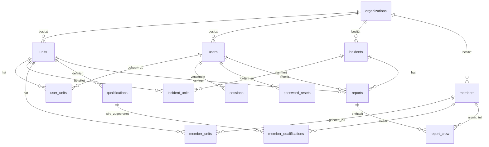

# Datenmodell

Das produktive Datenmodell liegt in MySQL 8. Maßgebliche Quelle für das Schema
ist `schema.sql`; `api.php` enthält die fachlichen Abfragen und
Validierungsregeln. Diese Datei beschreibt Tabellen, Beziehungen und
fachliche Regeln.

`GET /api/bootstrap` prüft vor Einrichtung und Anmeldung die Datenbankverbindung sowie das Vorhandensein aller in diesem Dokument beschriebenen Tabellen. Eine fehlende Konfiguration, nicht erreichbare Datenbank oder unvollständige Migration wird mit HTTP 503 gemeldet; dabei werden keine Zugangsdaten ausgegeben.
Die Anwendung initialisiert jede PDO-Verbindung explizit mit `utf8mb4`.
API-Routen bleiben unabhängig davon `/api/...`, ob die Anwendung im Dokumentenstamm oder in einem Unterverzeichnis installiert ist; der Installationspfad wird vor dem Routing entfernt.

`schema.sql` wird nicht durch den FTPS-Workflow deployt. Schemaänderungen
werden vor dem Anwendungscode kontrolliert über die Datenbankverwaltung des
Hosters eingespielt.

Für lokale Entwicklung initialisiert der MySQL-Container dasselbe
`schema.sql` nur beim Anlegen eines neuen Docker-Volumes. Die lokale
Webanwendung ist ausschließlich an die Loopback-Adresse gebunden und erhält
keine lokale Produktivkonfiguration.

## Überblick



Eine `organization` ist ein Mandant. Tabellen ohne eigene
`organization_id` werden über ihre übergeordnete Einheit, ihren Einsatz oder
ihren Bericht einem Mandanten zugeordnet. Die Anwendung prüft diese Grenze bei
jeder fachlichen Abfrage.

Sitzungen werden über HTTPS im `Secure`-Cookie `__Host-session` und während des temporären HTTP-Betriebs im Cookie `session` übertragen. Beide Varianten sind `HttpOnly` und `SameSite=Strict`.

## Tabellen

### `organizations`

| Spalte | Typ | Bedeutung |
|---|---|---|
| `id` | BIGINT UNSIGNED, PK | Interne ID der Wehr |
| `name` | VARCHAR(200), NOT NULL | Name der Wehr |

### `units`

| Spalte | Typ | Bedeutung |
|---|---|---|
| `id` | BIGINT UNSIGNED, PK | Interne ID der Einheit |
| `organization_id` | BIGINT UNSIGNED, FK | Zugehörige Wehr |
| `name` | VARCHAR(200), NOT NULL | Innerhalb der Wehr eindeutiger Name |
| `divera_access_key` | VARCHAR(500), NULL | Server-seitiger DIVERA-Schlüssel |

Eindeutig ist `(organization_id, name)`.

### `users`

Anmeldebenutzer sind von den in Einsätzen verwendeten Mitgliedern getrennt.

| Spalte | Typ | Bedeutung |
|---|---|---|
| `id` | BIGINT UNSIGNED, PK | Interne Benutzer-ID |
| `organization_id` | BIGINT UNSIGNED, FK | Zugehörige Wehr |
| `unit_id` | BIGINT UNSIGNED, FK, NULL | Kompatible Primärzuordnung; maßgeblich ist `user_units` |
| `name` | VARCHAR(200), NOT NULL | Anzeigename |
| `email` | VARCHAR(320), NOT NULL, UNIQUE | Syntaktisch validierte E-Mail-Adresse; Groß-/Kleinschreibung wird ignoriert |
| `password_hash` | VARCHAR(255), NOT NULL | Durch `password_hash` erzeugter Hash |
| `role` | ENUM, NOT NULL | `wehrleitung`, `einheitsleitung` oder `fuehrungskraft` |

Nur die Wehrleitung darf ohne Einheitszuordnung existieren.

### `user_units`

Viele-zu-viele-Zuordnung von Benutzern zu Einheiten.

| Spalte | Typ | Bedeutung |
|---|---|---|
| `user_id` | BIGINT UNSIGNED, FK, PK | Benutzer |
| `unit_id` | BIGINT UNSIGNED, FK, PK | Einheit |

Beide Fremdschlüssel werden beim Löschen ihres Elternsatzes kaskadiert.

### `sessions`

| Spalte | Typ | Bedeutung |
|---|---|---|
| `token` | CHAR(64), PK | Zufälliger 256-Bit-Sitzungswert |
| `user_id` | BIGINT UNSIGNED, FK | Angemeldeter Benutzer |
| `expires_at` | DATETIME, NOT NULL | Ablaufzeitpunkt; Sitzungen gelten zwölf Stunden |

Sitzungen werden beim Löschen des Benutzers mitgelöscht.

### `password_resets`

| Spalte | Typ | Bedeutung |
|---|---|---|
| `id` | BIGINT UNSIGNED, PK | Interne ID |
| `user_id` | BIGINT UNSIGNED, FK, UNIQUE | Benutzer mit höchstens einem aktiven Token |
| `token_hash` | CHAR(64), UNIQUE | SHA-256-Hash des zufälligen 256-Bit-Tokens |
| `requested_at` | DATETIME, NOT NULL | Zeitpunkt der Anforderung und Grundlage der Fünf-Minuten-Sperre |
| `expires_at` | DATETIME, NOT NULL | Ablaufzeitpunkt nach 30 Minuten |

Der Klartexttoken wird nur per E-Mail versendet und nie gespeichert. Nach erfolgreichem Zurücksetzen werden der Token und alle Sitzungen des Benutzers gelöscht. Beim Löschen des Benutzers wird auch sein Token mitgelöscht.

### `incidents`

| Spalte | Typ | Bedeutung |
|---|---|---|
| `id` | BIGINT UNSIGNED, PK | Interne Einsatz-ID |
| `organization_id` | BIGINT UNSIGNED, FK | Zugehörige Wehr |
| `divera_id` | VARCHAR(200), NULL | DIVERA-ID; bei manuellen Einsätzen leer |
| `foreign_id` | VARCHAR(200), NOT NULL | Externe Einsatznummer |
| `divera_date` | BIGINT, NULL | Unveränderter DIVERA-Zeitwert |
| `title` | VARCHAR(300), NOT NULL | Einsatzstichwort |
| `started_at` | VARCHAR(100), NOT NULL | Alarmierungszeit als ISO-Zeitpunkt |
| `message` | TEXT, NOT NULL | Meldung beziehungsweise DIVERA-`text` |
| `address` | VARCHAR(500), NOT NULL | Einsatzadresse |
| `lat`, `lng` | DOUBLE, NULL | Koordinaten |
| `remark` | TEXT, NOT NULL | Bemerkung |
| `patient` | TEXT, NOT NULL | Sensible Patientenangabe |
| `caller` | TEXT, NOT NULL | Sensible Angabe zur meldenden Person |
| `consolidated_text` | TEXT, NOT NULL | Gesamtbericht der Wehrleitung |
| `consolidated_at` | DATETIME, NULL | Zeitpunkt der Konsolidierung |

Ein importierter Einsatz ist über `(organization_id, divera_id)` eindeutig.
Ein erneuter Import aktualisiert ihn. Manuelle Einsätze haben keine
`divera_id`. Beim Import sendet der Browser nur diese ID; alle kanonischen
Einsatzfelder werden unmittelbar danach serverseitig erneut aus DIVERA
gelesen.

### `incident_units`

Verknüpft einen Einsatz mit den alarmierten Einheiten.

| Spalte | Typ | Bedeutung |
|---|---|---|
| `incident_id` | BIGINT UNSIGNED, FK, PK | Einsatz |
| `unit_id` | BIGINT UNSIGNED, FK, PK | Beteiligte Einheit |
| `vehicles` | JSON, NOT NULL | Liste der beim Import erkannten Fahrzeuge |

Ein Einsatz kann jeder Einheit nur einmal zugeordnet sein. Beim Löschen des
Einsatzes wird die Zuordnung mitgelöscht.

`vehicles` enthält für neue Importe Objekte dieser Form:

```json
[
  {
    "id": "42",
    "name": "FL HIL 01-LF20-01",
    "shortname": "LF 20",
    "fullname": "Löschgruppenfahrzeug 20",
    "own": true
  }
]
```

`own` bestimmt, ob das Fahrzeug in diesem Einheitsbericht als
Besatzungsziel verwendet werden darf. Ältere Datensätze können aus
Kompatibilitätsgründen reine Fahrzeugnamen enthalten.

### `members`

| Spalte | Typ | Bedeutung |
|---|---|---|
| `id` | BIGINT UNSIGNED, PK | Interne Mitglieds-ID |
| `organization_id` | BIGINT UNSIGNED, FK | Zugehörige Wehr |
| `divera_id` | VARCHAR(200), NOT NULL | DIVERA-Mitglieds-ID |
| `name` | VARCHAR(200), NOT NULL | Anzeigename |

Ein Mitglied ist über `(organization_id, divera_id)` innerhalb einer Wehr
eindeutig und kann mehreren Einheiten angehören.

### `member_units`

Viele-zu-viele-Zuordnung von Mitgliedern zu Einheiten.

| Spalte | Typ | Bedeutung |
|---|---|---|
| `member_id` | BIGINT UNSIGNED, FK, PK | Mitglied |
| `unit_id` | BIGINT UNSIGNED, FK, PK | Einheit |

### `qualifications`

| Spalte | Typ | Bedeutung |
|---|---|---|
| `id` | BIGINT UNSIGNED, PK | Interne Qualifikations-ID |
| `unit_id` | BIGINT UNSIGNED, FK | Einheit, aus deren DIVERA-Konfiguration sie stammt |
| `divera_id` | VARCHAR(200), NOT NULL | DIVERA-Qualifikations-ID |
| `name` | VARCHAR(200), NOT NULL | Bezeichnung |
| `shortname` | VARCHAR(100), NOT NULL | Kurzbezeichnung |

Eindeutig ist `(unit_id, divera_id)`.

### `member_qualifications`

Viele-zu-viele-Zuordnung von Mitgliedern zu Qualifikationen.

| Spalte | Typ | Bedeutung |
|---|---|---|
| `member_id` | BIGINT UNSIGNED, FK, PK | Mitglied |
| `qualification_id` | BIGINT UNSIGNED, FK, PK | Qualifikation |

### `reports`

| Spalte | Typ | Bedeutung |
|---|---|---|
| `id` | BIGINT UNSIGNED, PK | Interne Berichts-ID |
| `incident_id` | BIGINT UNSIGNED, FK | Zugehöriger Einsatz |
| `unit_id` | BIGINT UNSIGNED, FK | Berichtende Einheit |
| `author_id` | BIGINT UNSIGNED, FK | Erstellender Benutzer |
| `narrative` | TEXT, NOT NULL | Freitext des Einheitsberichts |
| `vehicles` | TEXT, NOT NULL | Abgeleitete, kommagetrennte Fahrzeugübersicht |
| `personnel` | TEXT, NOT NULL | Abgeleitete, kommagetrennte Personalübersicht |
| `alarmed_at` | VARCHAR(100), NULL | Alarmierungszeit aus `incidents.started_at` |
| `departed_at` | VARCHAR(100), NULL | Ausrückezeit |
| `arrived_at` | VARCHAR(100), NULL | Eintreffzeit |
| `ended_at` | VARCHAR(100), NULL | Einsatzende |
| `incident_type` | VARCHAR(100), NOT NULL | Validierte Einsatzart |
| `classification` | JSON, NOT NULL | Aufgliederung |
| `status` | ENUM, NOT NULL | `draft` oder `released` |
| `created_at` | DATETIME, NOT NULL | Erstellungszeit |
| `updated_at` | DATETIME, NOT NULL | Letzte Änderung |
| `released_at` | DATETIME, NULL | Freigabezeit |

Eindeutig ist `(incident_id, unit_id)`: Jede Einheit schreibt pro Einsatz
genau einen Bericht. Die vier Einsatzzeiten müssen chronologisch sein.
`alarmed_at` wird nicht vom Client übernommen. Die Dauer wird bei der Abfrage
als `duration_minutes` aus `alarmed_at` und `ended_at` berechnet und nicht
gespeichert.

`classification` hat drei Listen und enthält ausschließlich die in
`.github/copilot-instructions.md` festgelegten Werte:

```json
{
  "site": ["Verkehrsfläche"],
  "cause": [],
  "technical": ["Menschen in Notlage"]
}
```

Die Spalten `vehicles` und `personnel` sind nur lesbare Zusammenfassungen aus
`report_crew`; die strukturierte Zuordnung ist maßgeblich.

### `report_crew`

| Spalte | Typ | Bedeutung |
|---|---|---|
| `report_id` | BIGINT UNSIGNED, FK, PK | Bericht |
| `member_id` | BIGINT UNSIGNED, FK, PK | Eingesetztes Mitglied |
| `vehicle` | VARCHAR(200), NOT NULL | Fahrzeugname; leer bedeutet „Ohne Fahrzeug“ |
| `role` | ENUM, NOT NULL | `maschinist`, `einheitsfuehrer` oder `besatzung` |

Ein Mitglied kann pro Bericht nur einmal vorkommen. Pro Fahrzeug sind
höchstens ein Maschinist und ein Einheitsführer zulässig; die Besatzung ist
unbegrenzt. Ohne Fahrzeug ist nur die Rolle `besatzung` erlaubt. Diese Regeln
und die Zugehörigkeit des Mitglieds zur Einheit werden von der Anwendung
validiert.

Bearbeitung und Freigabe eines Berichts werden über eine Zeilensperre
koordiniert. Nach der Freigabe kann auch eine bereits begonnene parallele
Bearbeitung keine Daten mehr ändern. Der HTTP-Smoke-Test bildet dieses Race
mit zwei getrennten Datenbankverbindungen nach.

## Lösch- und Konsistenzverhalten

- Alle Tabellen verwenden InnoDB und `utf8mb4`; MySQL-Fremdschlüssel sind
  aktiv.
- Einsätze löschen ihre Einheitszuordnungen, Berichte und
  Besatzungszuordnungen kaskadierend.
- Benutzer löschen ihre Sitzungen und Einheitszuordnungen kaskadierend.
- Mitglieder und Qualifikationen löschen ihre Zuordnungen kaskadierend.
- Für Organisationen, Einheiten, Autoren und in Berichten verwendete
  Mitglieder gibt es bewusst keine allgemeine Löschfunktion.
- Mandantengleichheit, Rollen, Zeitreihenfolge, gültige Einsatzarten,
  Aufgliederungen und Besatzungsregeln werden zusätzlich im Server geprüft.

## Datenschutz

`password_hash`, `sessions.token` und `units.divera_access_key` dürfen nicht
über die API ausgegeben oder protokolliert werden. `incidents.patient` und
`incidents.caller` sind sensible Einsatzdaten und müssen stets auf den
aktuellen Mandanten begrenzt bleiben.
