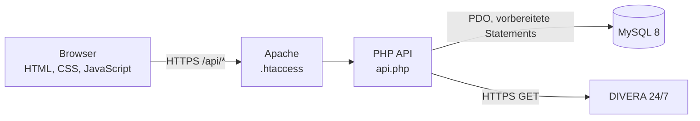

# Architektur

## Ziel

Die Anwendung bildet den vollständigen Weg vom alarmierten Einsatz über die
Einzelberichte der beteiligten Einheiten bis zum konsolidierten Bericht der
Wehrführung ab. Eine Wehr entspricht einem Mandanten; alle fachlichen Zugriffe
werden serverseitig auf diesen Mandanten begrenzt.

## Komponenten

- `public/index.html` enthält die responsive Oberfläche und verwendet native
  Browserfunktionen einschließlich Drag-and-Drop.
- `.htaccess` erzwingt HTTPS, schützt Konfigurationsdateien und leitet
  `/api/*` an `api.php` weiter.
- `api.php` enthält Routing, Validierung, Authentifizierung,
  Berechtigungsprüfung und fachliche Transaktionen.
- `schema.sql` ist die maßgebliche Definition des MySQL-Schemas.

## Authentifizierung und Autorisierung

Passwörter werden mit `password_hash` gespeichert. Nach erfolgreicher
Anmeldung erhält der Browser ein zwölf Stunden gültiges, zufälliges
`__Host-session`-Cookie. Es ist `Secure`, `HttpOnly` und `SameSite=Strict`.

Die API prüft bei jeder fachlichen Route Organisation, Rolle und gegebenenfalls
Einheitszuordnung. Die Oberfläche blendet unzulässige Funktionen zusätzlich
aus, ist aber nie die maßgebliche Berechtigungsgrenze.

Schreibende Anfragen müssen JSON verwenden. Ein vorhandener `Origin`-Header
muss exakt der HTTPS-Origin der Anwendung entsprechen.

## Einsatz- und Berichtsfluss

1. Ein Einsatz wird manuell angelegt oder anhand seiner ID aus DIVERA
   importiert.
2. Beim Import lädt das Backend die kanonischen Daten erneut mit dem
   serverseitig gespeicherten Schlüssel.
3. Jede alarmierte Einheit kann genau einen Bericht erstellen.
4. Führungskräfte ordnen Mitglieder den eigenen Fahrzeugen und den Funktionen
   Einheitsführer, Maschinist oder Besatzung zu.
5. Die Einheitsführung kann einen Entwurf bearbeiten und freigeben.
6. Freigegebene Berichte sind unveränderlich. Bearbeitung und Freigabe werden
   durch eine Datenbank-Zeilensperre koordiniert.
7. Die Wehrführung konsolidiert die Einzelberichte.

## DIVERA-Grenze

Die Integration verwendet nur feste HTTPS-Endpunkte und explizite
`GET`-Anfragen. Einsatzdetails werden beim Import nicht aus dem Browser
übernommen. Personal-Fahrzeug-Zuordnungen und Berichte werden ausschließlich
lokal gespeichert und niemals an DIVERA zurückgeschrieben.

## Betrieb

Produktiv läuft die Anwendung auf PHP-/Apache-Webspace mit MySQL und wird nach
erfolgreichen Tests per FTPS aktualisiert. Konfiguration und SQL-Dateien sind
vom automatischen Deployment ausgeschlossen.

Für lokale Entwicklung stellt `compose.yaml` Apache/PHP, MySQL und ein
selbstsigniertes HTTPS-Zertifikat bereit. Die Dienste sind nur an
`127.0.0.1` gebunden.

Details:

- [Installation und Deployment](../README.md)
- [Datenmodell](../DATENMODELL.md)
- [Security Review](../SECURITY-REVIEW.md)
